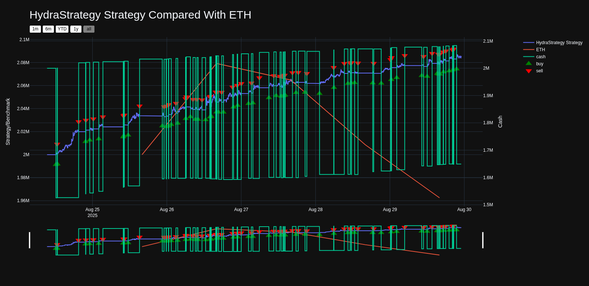
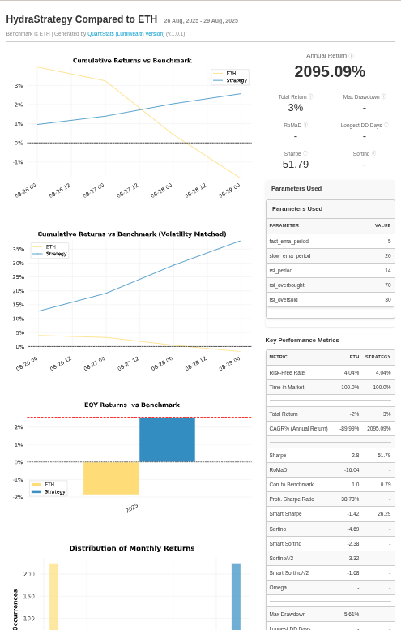

# Hydra Strategy

## Overview
The Hydra Strategy is an algorithmic trading strategy implemented in Python using the [lumibot](https://github.com/balojey/lumibot) framework. It is designed to execute live trades as well as perform backtesting using historical crypto market data fetched from the Orderly API.

---



---



---

## Features
- **Technical Indicators:**
  Employs EMA (Exponential Moving Average) indicators for short-term and long-term trend analysis, along with the RSI (Relative Strength Index) for momentum confirmation.
  
- **Trade Signals:**  
  Generates buy signals ("golden cross") when the fast EMA crosses above the slow EMA and sell signals ("death cross") when the fast EMA crosses below the slow EMA, provided the RSI is within defined thresholds.
  
- **Risk Management:**  
  Monitors portfolio cash levels to close positions if the cash exceeds the initial budget by more than 10% or drops below 50% of the initial budget, ensuring controlled risk.

## Setup and Dependencies
- **Python Version:** 3.12+
- **Dependencies:**  
  - `pandas`  
  - `ta`  
  - `requests`  
  - [lumibot](https://github.com/balojey/lumibot)  
- **API Integration:**  
  The strategy retrieves historical data from the Orderly API for backtesting. Make sure to configure any necessary API keys in your environment (typically via a `.env` file).

## Configuration
- **Assets:**  
  The strategy trades a crypto pair (e.g., ETH/USDC), where `ETH` is the base asset and `USDC` is the quote asset.
  
- **Parameters:**  
  - `fast_ema_period`: Period for the fast EMA indicator (default: 5).
  - `slow_ema_period`: Period for the slow EMA indicator (default: 20).
  - `rsi_period`: Period for the RSI indicator (default: 14).
  - `rsi_overbought` & `rsi_oversold`: Thresholds defining the overbought and oversold conditions.

## How It Works
1. **Initialization:**  
   The strategy sets the market to operate 24/7 and initializes assets for trading.

2. **Data Acquisition:**  
   Historical market data is fetched from the Orderly API and formatted into a pandas DataFrame with proper datetime indexing.

3. **Signal Generation:**  
   - **Buy Signal:** A golden cross is detected when the fast EMA is greater than the slow EMA and the RSI is within the defined range. If no position exists, a buy order is placed.
   - **Sell Signal:** A death cross is detected when the fast EMA is below the slow EMA while the RSI remains within the thresholds. If a position is held, a sell order is executed.

4. **Risk Management:**  
   The strategy continuously monitors cash levels:
   - Closes positions if cash exceeds the initial budget by more than 10%.
   - Closes positions if cash falls below 50% of the initial budget.

5. **Backtesting:**  
   The backtesting mode simulates trades on historical data using the [PandasDataBacktesting](https://github.com/lumibot-io/lumibot/blob/main/lumibot/backtesting.py) engine, allowing you to evaluate performance before deploying the strategy live.

## Running the Backtest
To run the backtest

1. Ensure you have poetry install: [Download here](https://python-poetry.org/)

2. Go into directory and install dependencies:

```sh
cd hydra-strategy
poetry install
```
3. Execute the strategy from the command line:

```sh
poetry run python hydra_strategy.py
```

This will fetch the historical data, execute the backtesting routines, and display performance metrics and trade logs.

## Source Code
For more details on the implementation, review the source code in [hydra_strategy.py](hydra_strategy.py).

---

This repository is structured to support further extensions and improvements, including additional strategies and enhancements to trading logic